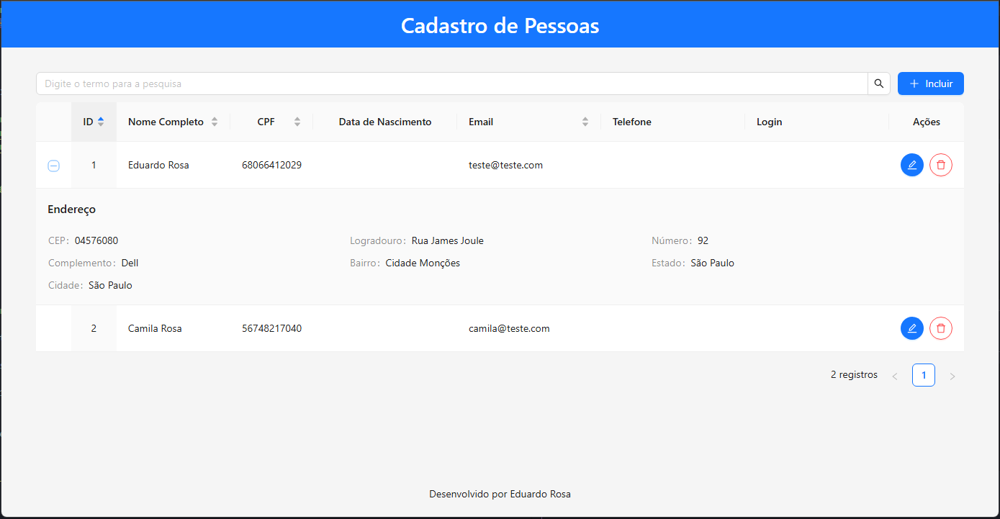
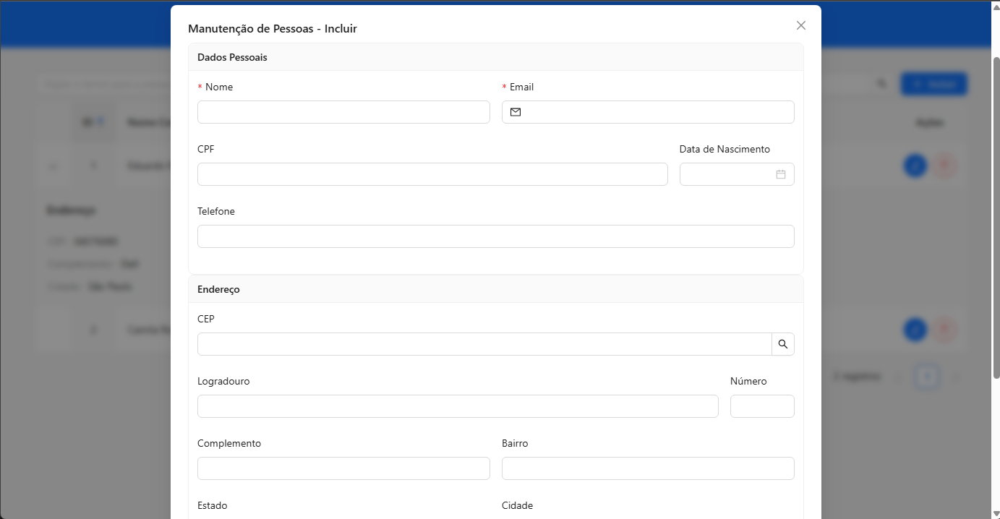

<h1 align="center" style="font-weight: bold;">Cadastro de Pessoas 💻</h1>

<h2 id="sobre">📌 Sobre</h2>

<p>Este projeto se trata de uma aplicação web de cadastro de pessoas que foi desenvolvida como teste técnico. O sistema permite incluir, editar, excluir e visualizar (CRUD) dados pessoais e de endereço. Possuí também o preenchimento automático do endereço via API do ViaCEP.</p>

---

<h2 id="layout">🎨 Layout</h2>

<p align="center">
  
</p>

<p align="center">
  
</p>

<h2 id="tecnologias">💻 Tecnologias</h2>

- React
- TypeScript
- Vite
- Ant Design
- Dayjs
- ViaCEP API

<h2 id="rodar_projeto">🚀 Como rodar o projeto</h2>

<h3>Pré‑requisitos</h3>

<p>Para rodar esse projeto é necessário ter o Node.js instalado. Abaixo a versão utilizada:</p>

- Node.js (v22.17.0)
- NPM (10.9.2)

<h3>Clonar projeto</h3>

```bash
git clone https://github.com/eduardojsrosa/cadastro-pessoas.git
```

```bash
cd cadastro-pessoas
```

<h3>Instalação</h3>

```bash
npm install
```

<h3>Executar em modo desenvolvimento</h3>

```bash
npm run dev
```

<p>O projeto abrirá em:</p>

```
http://localhost:5173
```

---

<h2>🏗️ Estrutura do projeto</h2>

```
src/
 ├─ types/           # Tipos do domínio (Pessoa, Endereco, FormValues)
 ├─ mappers/         # Conversão entre entidade e dados do formulário
 ├─ components/      # Componentes reutilizáveis (Tabela, Modal, Page)
 └─ main.tsx         # Entrada da aplicação
```

<h3>Organização</h3>

- **types/** → Representa o modelo de domínio da aplicação
- **mappers/** → Responsável por traduzir dados entre a interface visual e a entidade
- **components/** → Componentes visuais
- **pages/** → Responsável pelo estado e regras da tela

Essa separação evita acoplamento entre formulário e entidade de domínio.

---

<h2>⚙️ Observações técnicas relevantes</h2>

<h3>Estado da aplicação</h3>

A aplicação não utiliza backend nem banco de dados. Os dados são mantidos apenas em memória através do `useState` no componente de página principal.

<h3>Consulta de CEP</h3>

Foi implemento uma integração com a API pública ViaCEP para buscar e preencher os dados de endereço:

```
https://viacep.com.br/ws/{cep}/json/
```

O preenchimento ocorre sob demanda pelo usuário.

<h3>Validações</h3>

- Tipagem estática com TypeScript.
- Regras de formulário via Ant Design (campos obrigatórios, somente números, limitação de tamanho).

<h3>Interface</h3>

Para o desenvolvimento da interface da aplicação foi utilizado a biblioteca de componentes Ant Design. Alguns recursos utilizados são:

- Tabela com ordenação, paginação e linhas expansíveis para mostrar os dados de endereço.
- Modal com seções organizadas por `Card`
